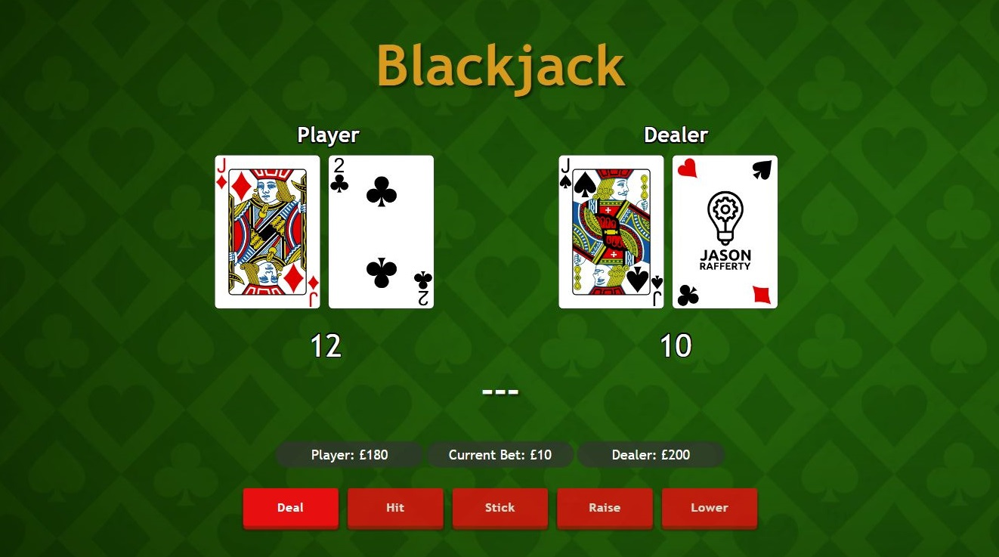

# Blackjack | Project 3

## Intro

Having gained experience in Java, I was eager to advance my programming skills by exploring a new programming language 🚀🌟. Consequently, I embarked on a project to create a blackjack game using HTML, CSS, and JavaScript, as it provided a substantial challenge that required all three of these technologies. The initial stages of working with CSS were challenging, especially when it came to aligning the cards and counters on the user interface. 😅 However, as I persisted, I began to grasp the intricacies of CSS and improve my design skills. 🎨💪

It's worth noting that I didn't rely on any pre-made templates for this project. 🚫🧩 Instead, I embraced a trial-and-error approach, allowing me to learn and adapt organically. 🌱🧐 I believe that this project marks a significant milestone in my journey as a software developer, showcasing my ability to independently create a complex application from scratch. 💻👨‍💻

  
      
Figure 1: Blackjack Initial Game Interface

## UI Development

In terms of the user interface (UI) design, my goal was to create a polished and minimalist appearance. I aimed to provide players with the opportunity to compete against a virtual dealer, which led to the separation of the game into distinct player and dealer sides. To ensure flexibility, I implemented a responsive design that allows the UI to adapt seamlessly to various window sizes. The buttons were designed to be interactive, enhancing the player's engagement.

Incorporating both a money counter and a card counter was essential to offer players clear and immediate information. Additionally, I integrated a full deck of cards, which is randomly selected and managed using JavaScript for a more authentic and dynamic gaming experience.

## In-game Functionality 

To ensure robust functionality, I implemented five key game logic functions:

- Deal: Activated upon clicking the "Deal" button, this function is responsible for dealing initial cards to both the player and the dealer. It updates their card counts, checks for a blackjack, and manages changes in player and dealer credits.

- Hit: This function enables the player to draw additional cards. It monitors the number of cards dealt and keeps the player's card count up-to-date.

- Stick: When the player chooses not to draw more cards, this function simulates the dealer's turn. It draws cards for the dealer and updates the dealer's card count.

- Raise Bet: This allows the player to bet more money.
  
- Lower Bet: This allows the player to bet less money.

While traditional blackjack often includes more complex options like splitting, I deliberately kept the game mechanics simple to avoid unnecessary complications and maintain a straightforward and enjoyable gaming experience.

  
      
Figure 2: Blackjack Game

## Game Logic Functions

The "deal" function generates a random number between 1 and 13, representing different types of cards from Ace to King. It then associates the generated value with a corresponding card image and assigns it to a designated HTML element. Special cases for Jack, Queen, and King cards are treated as having a value of 10.

When the player uses the "hit" function, an additional card is drawn, updating the player's card count. Choosing "stick" reveals the dealer's second card. If the dealer's total hand value is below a certain threshold, the "dealerHit" function is triggered to attempt to beat the player's hand.

Following these actions, three functions are employed: "checkBust," "checkWinner," and "checkLoser." "checkBust" automatically ends the game if either the player or dealer surpasses 21 points. "CheckWinner" determines whether the player's total value is higher, in which case the player wins. In case of a loss, as shown in figure 2, the dealer claims the money.

A mechanism is also in place for the player or dealer running out of money, offering an option to start a new game toward the end.

  
      
Figure 3: Blackjack Player Loses

## Error Handling

This game has many intricacies, so there are numerous error-handling components in place, with the primary ones being:

- Sufficient Funds Verification: The code incorporates logic to ensure that players possess adequate funds to place bets before proceeding with the dealing process.

- Card Dealing Restraint: The code keeps tabs on the number of cards dealt, preventing players and the dealer from exceeding predefined limits or making decisions when the game is concluded.

- Zero Credits Safeguards: There are dedicated functions that scrutinize whether the player's or dealer's credits have dwindled to zero.

These mechanisms are integrated to ensure a seamless and glitch-free gaming experience.

## Future Improvements

As I progress in my coding journey, my aim is to implement these features in the future to enhance the project. 

- Utilise Arrays for Card Handling: In the deal function, it's advantageous to employ arrays to store card values along with their corresponding image arrays. The use of arrays significantly enhances code readability and maintainability. This approach eradicates redundancy within the code and simplifies the logic, making it adaptable to future changes or expansions.

- Enhance AI Strategy: Currently, the dealer's AI hits only when the player's card counter is below 16. A more sophisticated approach involves implementing the "Soft 17" rule, requiring dealers to hit until they achieve a hand value of 17 or higher.

- Card Management: The current limitations on the number of cards a player can draw is 4 and the dealer can draw is 3 result from CSS constraints and the need to fit cards correctly on the screen, which somewhat complicates the logic. Ideally, this limitation should be expanded to reflect a more realistic gameplay scenario. While it's not essential for playing the game, accommodating additional cards ensures a more authentic gaming experience.

## Conclusion

This project has provided me with valuable insights into front-end development 💻 . I take great pleasure in witnessing the game coming together and functioning seamlessly, igniting my passion for further development🌟 . I am committed to honing my skills in JavaScript and enhancing my proficiency in HTML and CSS. 🚀

